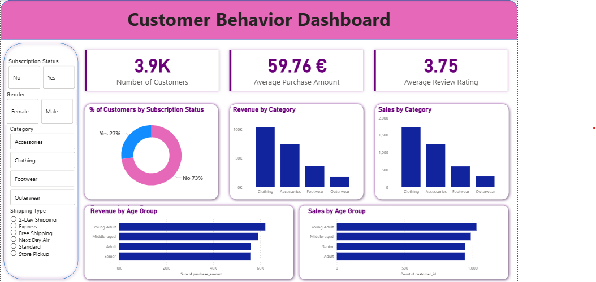

# customer-shopping-behaviour-analysis
Data analytics project focused on customer behaviour analysis with Python, SQL, and an interactive Power BI dashboard.

# 📊 Customer Shopping Behaviour Analysis

## 📌 Project Overview
This project focuses on analyzing customer shopping behaviour using transactional data to uncover insights into customer preferences, spending patterns, and business performance.

The objective is to transform raw data into actionable insights that support better business decision-making.

---

## 📂 Dataset Summary
- **Total Records:** 3,900+
- **Features:** 18 columns
- **Key Data Includes:**
  - Customer demographics (Age, Gender, Location, Subscription Status)
  - Purchase details (Item, Category, Amount, Season, Size, Color)
  - Shopping behaviour (Discounts, Purchase Frequency, Ratings, Shipping Type)

---

## 🛠️ Tools & Technologies
- **Python (Pandas)** → Data cleaning & exploratory data analysis  
- **SQL (MySQL)** → Business queries & data analysis  
- **Power BI** → Interactive dashboard & data visualization  

---

## 🔍 Project Workflow

### 1. Data Cleaning & Preparation (Python)
- Handled missing values in review ratings
- Standardized column names
- Performed feature engineering (age groups, purchase frequency)
- Ensured data consistency

### 2. Data Analysis (MySQL)
Key business questions answered:
- Revenue comparison by gender
- High-spending customers using discounts
- Top-rated products
- Subscriber vs non-subscriber behavior
- Shipping type impact on purchase value
- Customer segmentation (New, Returning, Loyal)

### 3. Dashboard (Power BI)
Developed an interactive dashboard to visualize:
- Revenue trends
- Customer segments
- Product performance
- Shipping insights
- Demographic analysis

---

## 📈 Key Insights
- High-value customers contribute significantly to revenue  
- Discounts influence purchasing behavior but need optimization  
- Loyal customers show consistent buying patterns  
- Subscribers and non-subscribers behave differently  
- Certain age groups generate higher revenue  

---

## 💡 Business Recommendations
- Introduce targeted loyalty programs  
- Optimize discount strategies  
- Focus marketing on high-value segments  
- Promote top-performing products  
- Enhance subscription offerings  

---

## 📊 Dashboard Preview

---

## 🚀 What I Learned
- Data cleaning and preprocessing using Python  
- Writing efficient SQL queries in MySQL  
- Building dashboards for business insights  
- Translating data into actionable recommendations  

---

## 📎 Project Structure
